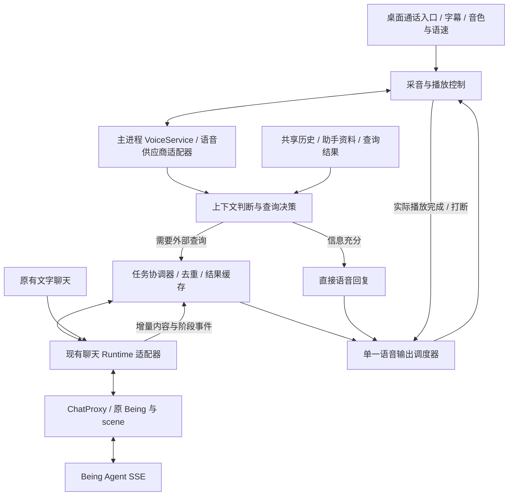
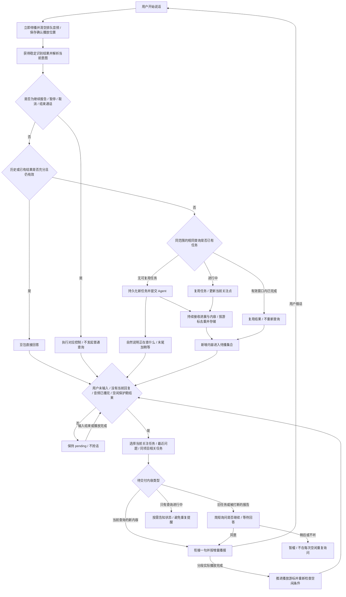

# being 语音流程接入 Portal Desktop

日期：2026-09-28。检查基线：Portal Desktop `46a2e32`，Heart Portal 子模块 `2bb2321`。

本文保留完整接入设计，并记录第一阶段实现。目标是把既有语音助手的交互流程融入当前 Being 对话，共用身份、场景、历史与 Agent 请求。第一阶段沿用豆包语音能力；更换开源模型是后续独立工作。

## 当前实现：右上角电话入口

桌面顶栏新增电话图标，点击直接打开通话弹窗并连接；未配置 Being 时引导连接设置。弹窗提供连接状态、时长、麦克风静音、红色挂断按钮、可关闭字幕与下次通话音色。关闭弹窗或 Escape 同样结束通话；连接失败保留错误说明与重试入口。

采音与播放在本地 shell；主进程 `VoiceService` 通过固定的现有语音网关 `/pipeline/ws` 转发协议，并附加已保存的 Being 链接。渲染器不接触 token，不连接外部任意地址。麦克风只在通话期间向可信顶层页面开放；音频 worklet 是打包资源，不依赖外部脚本。挂断释放麦克风、清空音频、关闭语音连接，不发送 Agent 取消操作。

本阶段复用的是既有远端语音服务的查询、报告和持久化逻辑。**文字聊天 runtime 与语音查询尚未统一发送，旧网页历史不会自动导入。** 新语音历史保存在桌面 IndexedDB，按 endpoint 与 scene 隔离，连接时携带最近 24000 字；远端任务作用域仍沿用旧服务规则。下方共享场景和查询协调器的设计仍属于后续阶段，不能把本次电话入口等同于全部迁移完成。

桌面验证命令：`npm run test:voice-desktop`。使用隔离测试 profile、本机 WebSocket 服务和合成麦克风，不访问真实 Agent、不录制物理麦克风。截图与测试产物写入忽略目录 `test-results/voice/`。

打包后运行 `npm run test:voice-package`，验证真正安装包内的主进程、preload、权限与音频 worklet。该测试使用独立 profile 和本机 Being/语音服务，检查接通、播放确认、隐藏窗口持续采音、挂断停止采音，不安装到用户日常环境。

### 助手资料首次对齐

桌面首次通话先通过主进程调用现有 `profile.status` 读取更新时间，凭据仍只在主进程使用。已有资料直接用于通话；没有资料则展示“对齐并开始通话”和“先跳过，直接通话”，选择前不打开麦克风或建立豆包语音会话。跳过选择按 Being endpoint 保存在本机，下次不反复阻挡通话，资料更新入口仍保留。

只有点击更新按钮才发送 `profile.refresh`，不会在每次接通时向 Agent 重新获取身份资料。桌面通话面板显示更新时间；首次更新成功继续开始通话，在已有通话中更新则下次通话生效。读取失败显示状态待确认而不是假报无资料；更新失败保留旧更新时间，并可重新读取。重复更新共用同一个正在进行的请求，关闭面板后的迟到结果不会重新打开麦克风。

手机端同步采用上述规则：设置中增加首次说明、跳过/开始通话和重新读取状态；成功更新后用户点击“开始通话”。资料保存在语音服务器，按 Being 链接隔离；浏览器保存链接、历史和跳过偏好。网页源在同级 `work/doubao_call.html`、`work/doubao_call.js`，分别部署为服务器的 `call.html` 与 `call-assets/call.js`。页面版本为 `profile-onboarding-20260928`，保留旧页面和脚本备份，未重启语音服务。新版脚本兼容旧 HTML 缓存。

此改动通过 29 个相关单元测试、隔离 Electron 首次对齐测试、真实打包程序测试，以及 `node work/test_profile_mobile.cjs` 手机尺寸测试（从同级工作区执行）。手机测试覆盖主动更新、跳过后重连、缓存复用、失败保留旧日期和旧 HTML 兼容。真实 `profile.status` 已读到原缓存时间，未主动刷新用户现有资料。

## 已核对的接入基础

| 能力 | 当前源码 | 接入方式 |
| --- | --- | --- |
| Being 链接解析 | `desktop/main/chat/connection.ts` | 复用现有连接，不再要求用户录入另一份 token |
| 凭据与网络请求 | `desktop/main/app/settings.ts`、`desktop/main/chat/proxy.ts` | 凭据留在主进程，复用白名单代理、endpoint 与 scene 校验 |
| SSE 与断线恢复 | `desktop/renderer/chat/services/runtime.js` | 复用流式事件、游标重放与历史对账；通过适配器增加任务事件 |
| 场景与发送队列 | `desktop/renderer/chat/services/scene-runtime.js`、`scene-queue.ts` | 文字与语音查询进入同一个发送协调器，避免重复提交 |
| 历史缓存 | `desktop/renderer/chat/services/history-cache.ts` | 复用服务端已确认的历史；语音本地交流、任务结果和播放进度另存并关联 |
| 桌面与聊天通信 | `desktop/renderer/app/hooks/use-chat-bridge.ts`、`desktop/renderer/chat/services/bridge.ts` | 沿用 origin、frame、revision 校验，增加固定类型的语音请求与任务事件 |
| 桌面后台运行 | `desktop/main/app/window.ts`、`tray.ts` | 关闭窗口隐藏时保留通话宿主；需要另测后台音频，不能从托盘运行推断麦克风可用 |
| 麦克风权限 | `desktop/main/app/protocol.ts` | 仅向正在通话的可信顶层页面开放音频采集，不开放摄像头或内置浏览器 |

当前 `SceneTask` 描述 Portal 子任务进度，`SceneQueueStore` 描述尚未确认发送的消息；两者都不能直接当作语音报告账本。需要单独记录“查询执行”和“报告交付”。

云端语音服务源码已纳入 [`services/voice-gateway`](../services/voice-gateway/README.md)，包含 `doubao_server.py`、`background_tasks.py`、`task_store.py` 和 `task_reports.py` 及其依赖。手机页面仍独立部署。迁移的是音频协议、播放确认、任务持久化与调度规则，不复制凭据文件或直接照搬页面。

2026-09-28 的查询标题更新已部署：每次 `ask_agent` 同时生成短标题，保留完整原请求；新结果、续播征询和失败提醒均带上任务主题。旧记录兼容处理，不重发查询、不额外调用模型起名。对应源码与离线回归测试见上述服务目录。

2026-09-29 已部署云端 `SpeechOutput`：直接回复、查询过渡和任务报告共用一个音频出口。按豆包的音频开始事件归属没有编号的 PCM 增量，查询交接与插话立即屏蔽旧回复，切换先清空旧播放队列。报告的迟到音频和清理不会抢占新回答；未播完的正文与已确认位置继续保留。兼容当前手机和桌面的 `playback.clear` 协议，无需改变客户端凭据。

同日已更新 Being 转交正文：豆包继续使用通话历史，将当前需求补全对象、时间与限制后写入 `ask_agent.message`；语音网关直接发送该需求，不再在前面拼接整段浏览器通话记录。场景标记和 Being 会话 ID 保持原有规则；已有历史未删除，客户端是否隐藏语音场景属于单独的展示规则。

2026-09-29 已部署按用户最近一次关联该任务的时间动态排序：当前回答先结束，再处理从近到远的待播报告和续播询问。后台结果返回时间不提升任务优先级；重新查看或续播旧任务会提升其优先级，但不会重发 Agent 查询。正在读的旧报告可在确认播放的句末让位，保留游标后继续。该顺序由网关调度保证，豆包提示词同时约束它不要主动抢播旧结果。

## 应用中的结构

- React 通话组件放在顶层 shell 的 `desktop/renderer/voice/`，不依赖隔离聊天 iframe 的麦克风权限。
- 主进程新增 `desktop/main/voice/` 管理供应商连接；固定 IPC 与跨进程契约放在 `desktop/preload/preload.ts`、`desktop/shared/`。
- 语音模型只提出查询意图，由应用决定复用或创建任务。所有 Agent 请求只允许一个协调器实际发送。
- 先给现有聊天 runtime 增加带任务 ID 的提交、订阅与恢复适配器，保留其 SSE 行为，不另写一套竞争的发送队列。
- 挂断只关闭采音、语音连接与播放，不 dispose 整个聊天 runtime；是否取消 Agent 必须由独立操作表达。
- 语音模型可以通过供应商适配器替换；本期不同时迁移模型，便于定位桌面接入问题。

## 完整交互流程

查询提交与过渡回复并行，不等待过渡句播放完才开始查询。任务的新内容可在任务结束前播报，但要满足同一套空闲条件。未收到新的有效事件时不反复填充“还在查”。

## 三组独立状态

| 状态域 | 拟采用状态 | 含义 |
| --- | --- | --- |
| 通话连接 | `disconnected / connecting / active / reconnecting / closing / error` | 只表达语音连接状态 |
| 查询执行 | `queued / running / completed / failed / cancelled / interrupted` | 后台请求真实进展，不由是否正在朗读推断 |
| 报告交付 | `waiting / pending / speaking / paused / awaiting_choice / deferred / delivered` | 结果是否读过、读到哪里、是否等待用户决定 |

用户输入、当前轮回答生成、音频播放与后台任务忙碌应分别记录。Agent 正在查询时仍可聊天；查询完成不意味着可以立即插话。执行失败也可能留下可读取的部分结果，必须标注未完整返回。

报告调度只有一个音频所有者。每次打断递增输出代号，作废旧代号的迟到音频和播放确认，防止已停掉的报告继续播放。

## 必须保留的交互规则

1. **上下文先行。** 记录信息来源、更新时间与是否缺失；能回答的解释、复述和追问直接回答。要求最新状态或上下文不足时查询，不编造实时结果。
2. **准确复用。** 范围至少包括 Being 身份、scene、项目、查询目标、参数和时效要求；“查任务”与“取消任务”不能合并。无法确认相同时不强行复用；明确要求刷新时允许新查询。后台按任务 ID 再做幂等保护。
3. **执行和交付分离。** 插话、暂停报告、挂断不等于取消查询；只有明确取消才发送取消指令。不能把用户发声接到原聊天 `/api/stop`。
4. **当前对话优先。** 优先响应用户最新一轮输入。后台结果先入库，在用户输入与当前回答结束、音频队列排空后才参与调度。
5. **旧报告需征询。** 例如“刚才那个任务有结果了，要现在听吗？”；拒绝后等待用户主动提起或有相关的新上下文。同一结果版本不重复征询，避免形成提醒循环。
6. **完整保存、可重复读取。** 结果全文和获取游标独立于已播游标。默认按完整内容分段播报，用户要求摘要时才摘要；生成了音频不算已读，收到有效播放确认后才推进游标。
7. **可恢复打断。** 在未确认完整播完的句子边界续播，允许明确“从头再说”。当前轮回答与所有报告共用停止和清空机制。
8. **身份与场景隔离。** 通话开始时绑定 scope。切换 Being 关闭旧通话；切换 scene 暂停旧场景播报，显式重新绑定，旧任务仍归原 scope，不能冒入新对话。
9. **资料主动更新。** 连接时读取缓存；用户主动更新助手资料并保存更新时间，不每次握手查询 Agent。
10. **离开通话。** 用户说再见时先播完告别再挂断。沿用 30 秒空闲退出要求，但后台任务、当前回复、待交付报告或用户输入存在时不当作完全空闲；空闲阈值与征询冷却独立。

去重窗口、空闲保护时长、征询冷却先做可配置参数，再通过实际通话测量调整，不能把固定计时当作用户是否说完的唯一判断。

## 持久化与生命周期

任务账本至少保存 `taskId`、scope、归一化查询、原问题、执行状态、原始结果、上游流 ID/事件游标、已确认播放位置、交付状态、创建/更新时间、最近提示版本。已有聊天缓存只承担历史投影，不作为后台任务唯一来源。

原网页缓存位于原站点的浏览器存储，不会自动出现在 Electron 的新源中。首次迁移需明确导入路径或从既有服务重新读取；不能展示“历史已同步”而实际只有新聊天缓存。API key 和 Being token 不写入仓库、iframe URL、任务正文或日志。

第一阶段区分三个承诺：窗口隐藏时宿主保持运行；显式退出时保存任务记录和播放位置；重新打开后利用已确认的上游流 ID/历史恢复。客户端完全退出后仍继续接收结果，需要独立后台服务，不从 Rust Portal 常驻能力推断语音任务也会继续执行。没有恢复证据的请求标记为中断，不自动重新提交以免重复执行。

## 实施顺序与验收

| 阶段 | 交付 | 验收 |
| --- | --- | --- |
| 1. 桌面通话基础 | 通话入口、可信页面麦克风权限、采音/播放、豆包适配、字幕、音色/语速 | 点击接通与挂断、权限拒绝可恢复、无视频、窗口隐藏、系统设备变化 |
| 2. Agent 统一入口 | 连接复用、scene 绑定、runtime 适配器、任务账本、流式结果 | 同一请求只发送一次，查询期间可交谈；断流重放不重复文本 |
| 3. 报告调度 | 上下文判断、去重窗口、空闲仲裁、询问续播、播放确认 | 迟到结果不抢话、任何报告可打断、未读全文可继续或重播 |
| 4. 桌面生命周期 | 关闭隐藏、断网、休眠恢复、重开状态对账 | 不误恢复麦克风、不把旧场景结果读到新场景、不隐式重发任务 |

回归应使用延迟与乱序可控的本地 Agent/语音 fixture，覆盖：连续两次相同查询、同字不同参数、长任务晚到、多个任务同时完成、播放确认晚到、断网重连、身份切换、用户拒绝续播、应用退出与重启。完成后再用真实麦克风验证中文断句、回声和打断延迟。

## 本次验证与 Windows 产物

- 已克隆仓库并初始化固定版本的 `heart-portal` 子模块。
- `npm ci --no-audit --no-fund` 完成。
- `npm run typecheck`、`npm run build:chat` 通过。
- 架构、连接、聊天 runtime、场景、历史范围、Web 聊天、主进程启动及新增语音逻辑共 11 个测试文件、169 个测试通过。
- 隔离 Electron 测试验证了采音、播放确认、静音、字幕开关、挂断与断线提示。真实打包程序测试另确认隐藏窗口时持续采音，挂断后停止发送音频；未改变日常客户端配置或注册系统后台服务。
- Rust release 引擎、Forge 应用目录、Windows NSIS 安装包与 ZIP 均已构建。打包使用 Node 24.19.0；本机 24.16.0 在 `extract-zip` 解压 Electron 时提前退出，未生成应用目录。可用已有 24.19.0 runtime 执行 `scripts/make-desktop.mjs` 完成打包。
- 真实远端链路：问候录音完成识别和回复音频接收，握手约 1.98 秒。明确要求重新查询当前任务状态的只读测试，握手约 0.81 秒，仅新建 1 个任务，收到 36 次进度事件、520 字正文和报告语音帧；后台约 34.3 秒开始返回正文，42.9 秒完成。没有创建、修改或取消用户的业务任务。
- 上述真实测试没有录制物理麦克风，也没有将原有未读报告确认成已读。已验证报告语音开始返回，未验证整份长报告播完、真人回声处理或真实插话的主观体验。现有远端语音服务代码未修改。

产物：`out/make/nsis/portal-desktop-0.1.7-windows-x64-Setup.exe`（安装包）、`out/make/nsis/portal-desktop-0.1.7-windows-x64.zip`（完整免安装目录）。安装包未做代码签名；尚未执行安装或发布。独立可执行文件必须与同目录资源一起运行，不能只复制 `portal-desktop.exe`。

加入首次对齐后的安装包 SHA-256：`e4d28f20a3e8f58623ef665444f5bddc980ac8c131c97e126f5072bbb0546719`。
