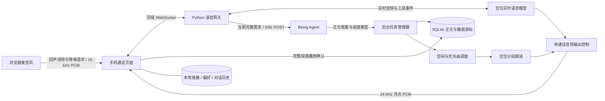
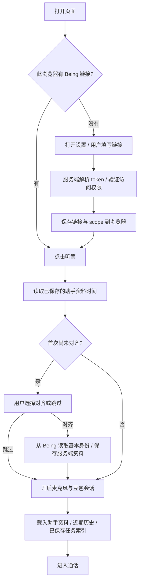
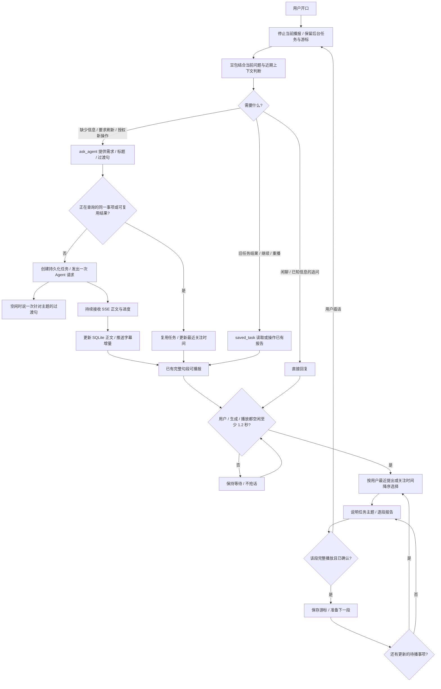
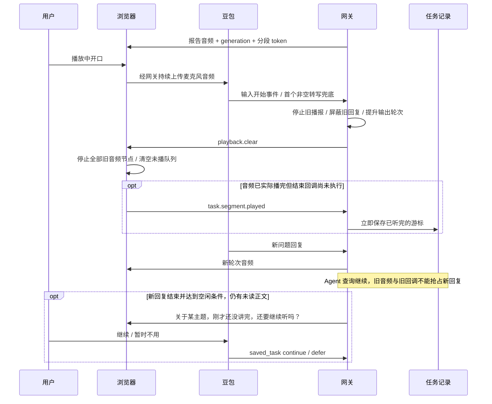

# Being 语音通话流程与状态

本文描述本目录代码的实际行为。网页是通话客户端；豆包负责实时语音理解与直接回复；Being 处理需要外部信息或实际操作的请求；网关持久化任务并安排播报。当前没有另一个本地意图识别模型。

## 组件与数据流

“单通话音频输出控制”指一个 WebSocket 会话只保留一个声音来源。不同终端同时通话仍有各自的播放器；当前没有跨终端全局声音互斥。

## 首次设置和连接

每个控制连接均验证用户链接。普通重连只读取已保存资料，不自动向 Being 发出新的资料查询；“更新助手信息”才请求更新。用户首次主动对齐也属于显式更新。资料保存在服务端、按 scope 隔离；完整文字历史保存在浏览器。

## 每轮问题与后台任务

图中的循环在正文读完时结束；流仍在运行但暂无完整句段时，报告进入 `waiting`，释放输出等待新内容。用户最新问题的直接回复优先于待播任务；旧任务仅在句子已确认播放的边界给更新的待播任务让位。用户插话则立即执行停播，不等句末。

当前去重是同一 scope 下的规范化问题匹配，不是任意语义近似识别：在途重复请求复用同一任务；通用任务列表查询成功后有约 60 秒复用窗口。不同项目、时间、过滤条件或新操作不能合并。模型先判断是否真需要查询，网关再做确定性的去重。

## 两套独立状态

任务“请求进展”和“播报进展”分开保存；停止播报不等于取消查询。

| 字段 | 状态 | 含义 |
| --- | --- | --- |
| `state` | `running` | Agent 请求仍在执行或等待 |
| `state` | `completed` | 本次查询正常结束并收到正文；不代表外部业务任务已经完成 |
| `state` | `error` | 出错、超时或无可用正文；部分文本仍保留 |
| `state` | `interrupted` | 服务退出/重启等导致请求中断，不自动重提交 |
| `delivery` | `waiting` | 等待文本或在句末让位后等待恢复 |
| `delivery` | `pending` | 已安排报告，等待可用交流时机 |
| `delivery` | `reporting` | 正在逐段播报 |
| `delivery` | `paused` | 被打断或音频失败，保留游标 |
| `delivery` | `asking` / `awaiting_choice` | 正在询问续播 / 已问完等待用户选择 |
| `delivery` | `reported` | 已收到正文全部确认播完 |
| `delivery` | `deferred` | 用户选择暂不报告，全文仍可重复读取 |

任务还保存 `id`、原请求 `request`、短标题 `title`、完整 `text`、已播放字符位置 `cursor`、创建时间、更新时间和 `requested_at`。只有用户提出、追问或要求重播才更新 `requested_at`；Agent 晚返回不能自动提升优先级。

## 打断、末尾抢接与续播

客户端按 AudioContext 播放时钟确认完整段落；网关确认处理时立即保存游标，并为迟到确认保留 3 秒窗口。确认必须属于本次播放尝试；重播之后旧 token 不能推进新的游标。半句被打断会从该段开头重读，避免漏信息；只有报告具有这种精确续播机制，普通豆包聊天没有同样的报告游标。

当前没有本地语义 VAD、声纹判断或专门的“嗯/附和”过滤器。回声消除、降噪由浏览器请求设备提供，打断依据豆包输入事件；设备、背景人声与网络都可能影响实际效果。

## SSE、进度和上下文边界

- Agent 的 SSE 按 `scene_id` 和 `stream_id` 归属过滤，使用事件 ID 去重；浏览器按增量 offset 去重。只显示关联任务的回复。
- 接到多少正文就保存、显示多少；报告按完整句段朗读，最长分段约 160 字，只预合成下一段。这里没有新增“一句摘要替代全文”的策略。
- HTTP 202 表示已接收并排队，不重新 POST；使用历史序号 cursor 查询后续关联回复。仍可能等到对应历史消息可用后才收到内容，不能把这条降级路径等同于实时 SSE 增量。
- thinking 和工具调用转换成“分析中、调用工具、生成中”等进度类型；不向浏览器发送隐藏思考正文或工具参数。
- 浏览器完整文字历史留在 IndexedDB。豆包启动使用约 24000 字的近期窗口、已保存资料和最近任务索引；Being 收到的 `message` 只有补全必要指代后的当前需求，不粘贴整个通话记录。
- 后台请求最长约 600 秒，无进展约 300 秒后结束等待并保留已收到内容。网页断开不取消服务端查询；服务进程退出仍会中断运行中的请求。
- 当前界面隐藏后台任务面板，但状态、全文读取与续播协议仍保留。用户可以通过语音 `saved_task` 反复获取已有结果。

## 结束通话

用户明确告别触发 `end_call`：播完简短告别后关闭当前通话。用户主动挂断、页面进入后台/锁屏、传输持续拥堵也会结束客户端通话。没有后台任务、生成、输入或播放且持续空闲 30 秒时自动结束；后台查询结果仍由任务管理器保存。

## 代码入口

| 职责 | 文件 |
| --- | --- |
| 网页、麦克风、播放确认、本地缓存 | `mobile/index.html`、`mobile/call.js` |
| 独立网站入口 / 原网关入口 | `serve.py` / `doubao_server.py` |
| 模型、系统指令与三类工具 | `doubao_config.py` |
| 链接验证与 SSE 适配 | `agent_endpoint.py`、`agent_bridge.py` |
| 请求生命周期与持久化 | `background_tasks.py`、`task_store.py` |
| 报告续播与优先级 | `task_reports.py`、`turn_scheduler.py` |
| 音频来源互斥与旧事件过滤 | `speech_output.py` |
| 助手身份 / 历史窗口 / 数值用量 | `doubao_profile.py`、`conversation_memory.py`、`voice_usage.py` |
